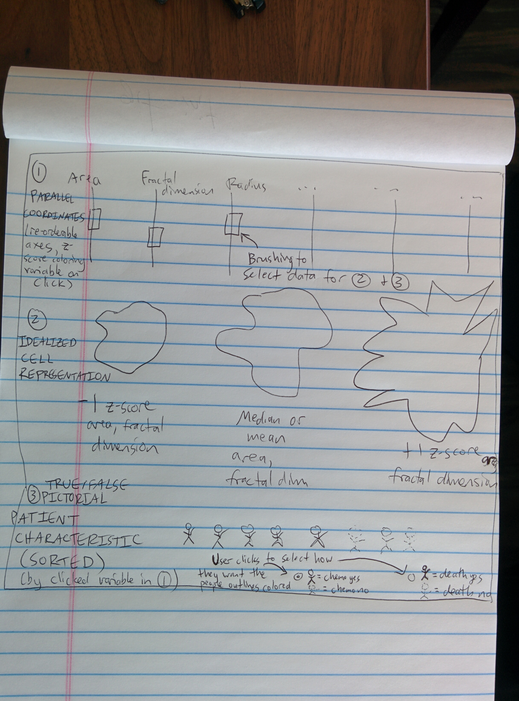

# a3-jheer-mcorrell-jhoffs
===============

## Team Members

1. David Caldwell (davidjuliancaldwell)
2. James Wu (jamesbrains)
3. Shirley Leung (shirleyswirley)

## Visualization of Cellular Features and Breast Cancer Prognoses

Cancer is a leading cause of death worldwide. The WHO estimates that 8.2 million deaths were caused by cancer worldwide in 2012 (http://www.who.int/mediacentre/factsheets/fs297/en/).  One method for both diagnosis and prognosis in solid tumors is the assessment of the histologic characteristics of cancer cells obtained by a biopsy.

Dr. Wolberg from the University of Wisconsin, and Professor Olvi Mangasarian from the University of Wisconsin collaborated and collected breast mass tissue from fine needle aspiration. (http://pages.cs.wisc.edu/~olvi/uwmp/cancer.html) Visual characteristics such as radius, area, and others were assessed. A dataset was compiled and curated for patients, with diagnostic data to assess new cases, as well as prognostic data (disease free survival time, recurrence) with metrics assessing these histological samples across time. The idea was for experts in machine learning approaches to be able apply their techniques to be able to more accurately diagnosis patients, as well as to predict long term survival and recurrence.

We decided that this would be a fun data set to visualize because of the possibilities for interesting pictorial representations of patients and cells, in addition to the fact that the data itself are very well-curated and complete.

Our final visualization ????? 

## Running Instructions

Access our visualization at http://cse512-16s.github.io/a3-davidjuliancaldwell-shirleyswirley-jamesbrains/ or download this repository and run `python -m SimpleHTTPServer 9000` and access this from http://localhost:9000/.

## Story Board

?????Put either your storyboard content or a [link to your storyboard pdf file](storyboard.pdf?raw=true) here. Just like A2, you can use any software to create a *reasonable* pdf storyboard.

### Changes between Storyboard and the Final Implementation

Our final implementation ended up being very close to our original storyboard. We stuck to our original plan of having 3 components all talking to each other via brushing on our parallel coordinates component.

Along the way, there was a period of time where we had abandoned this idea because getting the brushing on the parallel coordinates to send out the subselected data to our other components was proving somewhat challenging. Instead, we were going to have sliders for multiple variables where the user could select the ranges of data they wanted to see and have a function to pass this filtered data to all of the components, which would be static, based on the min and max of each slider.   

In the end, we persevered and figured out how to get parallel coordinates brushing able to send the brushed data to our other components, so we were able to stick to our original plan. 

## Development Process

- Breakdown of how work was split among group members:
  -*James* created the idealized cell representation component to visually represent the variance and mean cell areas and fractal dimensions of the selected patients, which involved ...?????. 
  -*David* created the sortable boolean patient characteristic component, which involved ...?????
  -*Shirley* applied different capabilties of the parallel coordinates library to create the re-ordable, colored, and interactive components of the parallel coordinates component.
  -*Shirley* got the brushing on the parallel coordinates to talk to the other components.
  -*James* integrated all of the code together into one final tidy html page.
  -All 3 of us put together this writeup. 

- Time spent developing our application:
  -*James* spent about ????? 
  -*David* spent about ?????
  -*Shirley* spent a couple hours working with and understanding the parallel coordinates library and   

- Aspects taking the most time included:
  - DEBUGGING.
  - Learning javasc

Include:
- Breakdown of how the work was split among the group members.
- A commentary on the development process, including answers to the following questions:
  - Roughly how much time did you spend developing your application?
  - What aspects took the most time?
