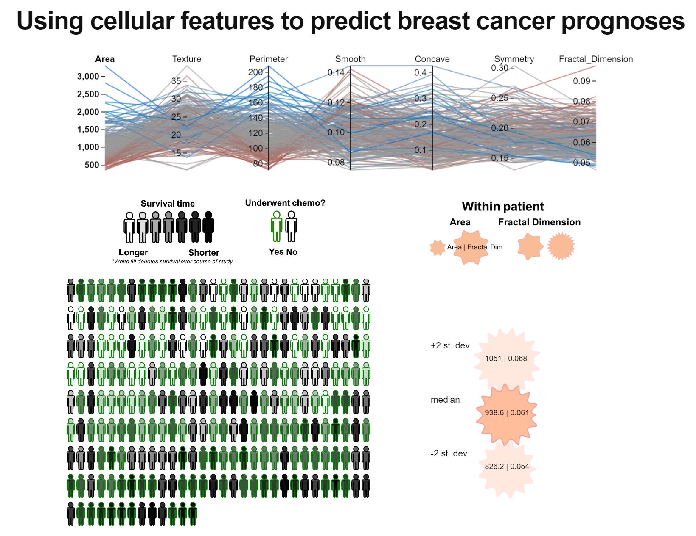

# a3-davidjuliancaldwell-shirleyswirley-jamesbrains
===============

## Team Members

1. David Caldwell (davidjuliancaldwell)
2. Shirley Leung (shirleyswirley)
3. James Wu (jamesbrains)

## Visualization of Cellular Features and Breast Cancer Prognoses

Cancer is a leading cause of death worldwide. The WHO estimates that 8.2 million deaths were caused by cancer worldwide in 2012 (http://www.who.int/mediacentre/factsheets/fs297/en/).  One method for both diagnosis and prognosis in solid tumors is the assessment of the histologic characteristics of cancer cells obtained by a biopsy.

Dr. Wolberg from the University of Wisconsin, and Professor Olvi Mangasarian from the University of Wisconsin collaborated and collected breast mass tissue from fine needle aspiration. (http://pages.cs.wisc.edu/~olvi/uwmp/cancer.html) Visual characteristics such as radius, area, and others were assessed. A dataset was compiled and curated for patients, with diagnostic data to assess new cases, as well as prognostic data (disease free survival time, recurrence) with metrics assessing these histological samples across time. The idea was for experts in machine learning approaches to be able apply their techniques to be able to more accurately diagnosis patients, as well as to predict long term survival and recurrence.

We decided that this would be a fun data set to visualize because of the possibilities for interesting pictorial representations of patients and cells, in addition to the fact that the data itself are very well-curated and complete.

Our final visualization has 3 components, which all talk to each other. At the top, we have a parallel coordinates chart with lines (each corresponding to a different patient) colored by z-score according to the clicked/bolded axis as well as reorderable and brushable axes.

Brushed data is then sent to our second component, which is a pictorial representation of patient's cells (in particular, their area and fractal dimension).In this idealized represntation of patient cells, the cell in the middle encodes the median cell area and fractal dimension of the brush-selected patients, while the cells on either side of it encode the median individual standard deviations of cell area and fractal dimension among the same brush-selected patients (minus 2 z-scores on the left, plus 2 z-scores on the right).     

The brushed data is also sent to our third component, which is a pictorial representation of brush-selected patients. The patients are ascendingly sorted by the clicked/bolded parallel coordinate axis. Their fill color encodes their survival time, while their outline color encodes whether they underwent chemotherapy or not. 

Our 3 components together help us to understand how observed cell properties are related to one another as well as to the prognostic survival time.  

## Running Instructions

Access our visualization at http://cse512-16s.github.io/a3-davidjuliancaldwell-shirleyswirley-jamesbrains/ or download this repository and run `python -m SimpleHTTPServer 9000` and access this from http://localhost:9000/.

## Story Board

Please click on the following to visualize our storyboard. [Storyboard link](storyboard.pdf?raw=true) 

### Changes between Storyboard and the Final Implementation

Our final implementation ended up being very close to our original storyboard. We stuck to our original plan of having 3 components all talking to each other via brushing on our parallel coordinates component.

Along the way, there was a period of time where we had abandoned this idea because getting the brushing on the parallel coordinates to send out the subselected data to our other components was proving somewhat challenging. Instead, we were going to have sliders for multiple variables where the user could select the ranges of data they wanted to see and have a function to pass this filtered data to all of the components, which would be static, based on the min and max of each slider.   

In the end, we persevered and figured out how to get parallel coordinates brushing able to send the brushed data to our other components, so we were able to stick to our original plan. 

We also originally wanted to have the user be able to choose what they wanted the pictorial patients to be colored and/or outlined by, which we got working in the stand-alone component, but did not end up integrating into the final full visualization.   

## Development Process

* Breakdown of how work was split among group members:
  * **James** created the idealized cell representation component to visually represent the variance and mean cell areas and fractal dimensions of the selected patients, which involved ...?????. He also did the bulk of the work integrating all of our code sets together into one functional visualizaion. 
  * **David** began data visualization and patient characteristic identification in Tableau prior to visualization design. David worked on creating the picture representations of patients that were visualized. He initially implemented a version with checkboxes allowing for highlighting via different characteristics, and sorting via clicking on patients, but this was subsequently abandoned to allow for more effective integration. He implemented the highlightable cursor over patients characterizing their survival time. 
  * **Shirley** applied different capabilties of the parallel coordinates library to create the re-ordable, colored, and interactive components of the parallel coordinates component. She also got the brushing on the parallel coordinates to talk to the other components, helped sort the pictorial patients based on the clicked parallel axis, and put together the final html page. 
  * All 3 of us put together this writeup. 

* Time spent developing our application:
  * All 3 of us spent a couple hours deciding on which dataset to use and doing data exploration in Tableau on the dataset we finally decided on. 
  * All 3 of us spent a couple hours coming up with visualization ideas and storyboarding together.
  * **James** spent about ????? 
  * **David** spent about 4 hours figuring out how to create individualized patient representations and converting these into a path to be created dynamically in d3. He then spent about 12 hours figuring out how to create sortable and highlightable patients that updated dynamically. He spent additional time attempting to try and integrate sortable and highlightable patients into the overall visualization that James was able to integrate in his overall integration scheme.  
  * **Shirley** spent a couple hours working with and understanding the parallel coordinates library, another couple hours figuring out how to filter and select read-in csv files, another couple hours figuring out how to deal with brushed data and sending that between components, another hour sorting patients based on parallel coordinate interactions, and another couple hours arranging html elements. 

* Aspects taking the most time included:
  * DEBUGGING
  * Learning JavaScript and D3 from scratch, in general
  * FIguring out what was possible in HTML/CSS/JS/D3 within our skillset and timeframe  
  * Getting our components to talk to each other
  * Deciding which components added value and wihch simply were flashy. 
